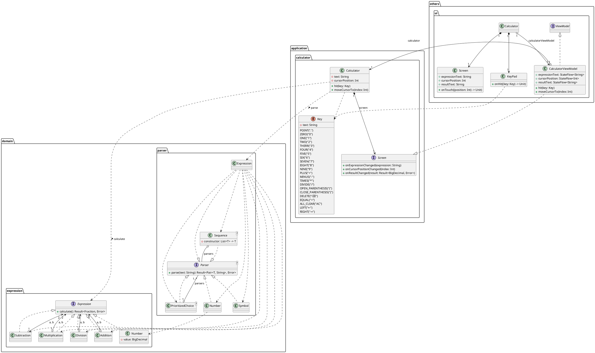

# Calculator App

## Class Diagram

```plantuml
@startuml


application.calculator.Calculator ..> domain.parser.Expression: parse >
application.calculator.Calculator ..> domain.expression.Expression: calculate >

others.ui.CalculatorViewModel "1" o--> "1" application.calculator.Calculator: calculator
others.ui.KeyPad ..> application.calculator.Key

package others {
    package ui {
        class Calculator {

        }

        class KeyPad {
            + onHit((key: Key) -> Unit)
        }


        class Screen {
            + expressionText: String
            + cursorPosition: Int
            + resultText: Strnig
            + onTouch((position: Int) -> Unit)
        }

        Calculator "1" o--> "1" CalculatorViewModel: calculatorViewModel
        Calculator "1" *--> "1" Screen
        Calculator "1" *--> "1" KeyPad

        class CalculatorViewModel implements application.calculator.Screen, ViewModel {
            + expressionText: StateFlow<String>
            + cursorPosition: StateFlow<Int>
            + resultText: StateFlow<String>
            + hit(key: Key)
            + moveCursorTo(index: Int)
        }
    }
}

package application {

    package calculator {
        interface Screen {
            + onExpressionChanged(expression: String)
            + onCursorPositionChanged(index: Int)
            + onResultChanged(result: Result<BigDecimal, Error>)
        }

        class Calculator {
            - text: String
            - cursorPosition: Int
            + hit(key: Key)
            + moveCursorTo(index: Int)
        }

        enum Key {
            - text: String
            POINT(".")
            ZERO("0")
            ONE("1")
            TWO("2")
            THERR("3")
            FOUR("4")
            FIVE("5")
            SIX("6")
            SEVEN("7")
            EIGHT("8")
            NINE("9")
            PLUS("+")
            MINUS("-")
            TIMES("*")
            DIVIDE("/")
            OPEN_PARENTHESIS("(")
            CLOSE_PARENTHESIS("(")
            DELETE("⌫")
            EQUAL("=")
            ALL_CLEAR("AC")
            LEFT("←")
            RIGHT("→")
        }

        Calculator "1" *--> "1" Screen: screen
        Calculator ..> Key
    }

}

package domain {

    package parser {
        interface Parser<T> {
            + parse(text: String): Result<Pair<T, String>, Error>
        }

        class Sequence<T> implements Parser<T> {
            - constructor: List<T> -> T
        }
        Sequence o-- Parser: parsers

        class PrioritizedChoice<T> implements Parser<T> {
        }
        PrioritizedChoice "1" o-- "1..*" Parser: parsers
        
        class Expression implements Parser<Expression> {
        }
        Expression ..> Sequence
        Expression ..> PrioritizedChoice
        Expression ..> Symbol
        Expression ..> Number
        Expression ..> domain.expression.Addition
        Expression ..> domain.expression.Subtraction
        Expression ..> domain.expression.Multiplication
        Expression ..> domain.expression.Division

        class Symbol implements Parser<Expression> {
        }

        class Number implements Parser<Expression> {
        }
        Number ..> domain.expression.Number
    }

    package expression {

        interface Expression {
            + calculate(): Result<Fraction, Error>
        }

        class Addition implements Expression {
        }
        Addition "1" o--> "2" Expression: a, b

        class Subtraction implements Expression {
        }
        Subtraction "1" o--> "2" Expression: a, b

        class Multiplication implements Expression {
        }
        Multiplication "1" o--> "2" Expression: a, b

        class Division implements Expression {
        }
        Division "1" o--> "2" Expression: a, b

        class Number implements Expression {
            - value: BigDecimal
        }
    }
}

@enduml
```